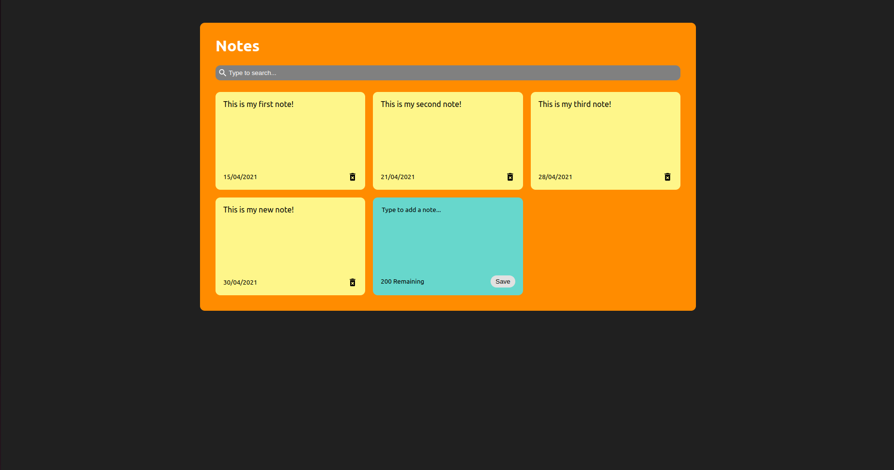

# Notes App

**[Test this app yourself](https://my-new-notes-app-react.vercel.app/)**

---

### About Project

Use this app to take your notes.

### How to use this Project

With this Ypp you can take, and  delete notes. You can also use the search bar to recall a lost note.

##### Developed With

- [x] _HTML5_
- [ ] _CSS3_
- [x] _SASS_
- [x] _SCSS_
- [x] _JavaScript_
- [ ] _React_
- [ ] _Bootstrap_
- [x] _npm_
- [ ] _..._

---

### Contact

Mail: <penninoematita@gmail.com> 
GitHub: [vincenzoarena](https://github.com/vincenzoarena) 
LinkedIn: [Vincenzo Arena](https://www.linkedin.com/in/vincenzo-arena-032a064b/)

---

### Used Tools

- [react-icons](https://react-icons.github.io/react-icons)
- [npm](https://www.npmjs.com/)
- [Google Fonts](https://fonts.google.com/)
- [Visual Studio Code](https://code.visualstudio.com/)

---
